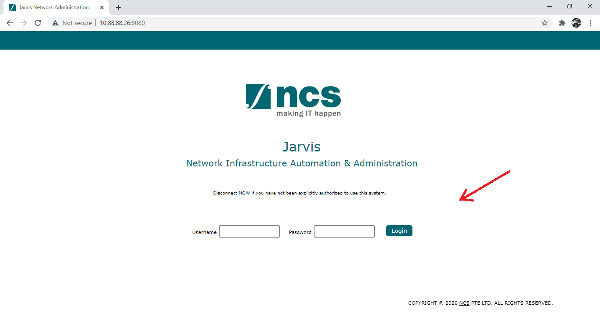

# Jarvis Network Administration

Jarvis Network Administration is a Web application to perform the following:

* Network Topology At A Glance
* Operations Dashboard
* Automate Datacenter Devices:
    - ACI
    - AEOS / Cisco ISE
    - Algosec
    - Allot
    - F5
    - Cisco FMC
    - FTD
    - Infoblox
    - IOS
    - NX OS
    - Palo Alto 
    - Proxy / McAfee
    - Viptela
* Role based User Management

# Production Setup

* Setup `CentOS8` with `jarvis` as username

* Setup ssh keys

       mkdir -p ~jarvis/.ssh
       touch $HOME/.ssh/authorized_keys
       sudo sh -c "cat $HOME/.ssh/authorized_keys >> ~jarvis/.ssh/authorized_keys"
       sh -c "cat $HOME/.ssh/authorized_keys >> ~jarvis/.ssh/authorized_keys"
       chown -R jarvis ~jarvis/.ssh
       chmod 700 ~jarvis/.ssh/
       sh -c "chmod 600 ~jarvis/.ssh/*"

* Copy all files to `/var/www/jarvis` and change ownership to `jarvis`

      sudo chown -R jarvis:jarvis /var/www/jarvis

* Create ACI, IOS and F5 Logs:

      cd /var/log/
      sudo mkdir jarvis
      cd /var/log/jarvis/
      sudo touch aci_runs.log f5_runs.log ios_runs.log
      sudo chown jarvis:jarvis aci_runs.log f5_runs.log ios_runs.log

* Copy `/var/www/jarvis/jarvis.service` file to `/etc/systemd/system/`

* Install Python Headers

      sudo yum install python3-devel

* Install Production required python packages
        
      sudo python -m pip install -r /var/www/jarvis/production_requirements.txt

* Allow port 8080 in the Firewall

      sudo firewall-cmd --zone=public --add-port=8080/tcp --permanent
      sudo firewall-cmd --reload

* Copy `ansible.cfg` file to `/etc/ansible`

      sudo mkdir /etc/ansible
      sudo cp /var/www/jarvis/ansible.cfg /etc/ansible/

* Copy `xls_to_facts.py` file to `/ansible/modules`

      sudo mkdir /home/jarvis/.ansible/plugins
      sudo mkdir /home/jarvis/.ansible/plugins/modules
      sudo cp /var/www/jarvis/xls_to_facts.py /home/jarvis/.ansible/plugins/modules/

* Make sure boot protocol in `/etc/sysconfig/network-scripts/ifcfg-ens33` is set to `none`

      BOOTPROTO=none

* Run set-network:

      python /var/www/jarvis/set-network.py
 
* Open browser and access Jarvis with admin created IP `http://<ip_addr>:8080`
 
* To view the Jarvis service logs, run `journalctl -u jarvis.service`

* To view the Menu, run `show-menu`

## Screenshots

#### 1. Login Page:

#### 2. Landing Page as Admin:

#### 3. Landing Page as Non-Admin:

#### 4. Automation Modules as Admin:

#### 5. Automation Modules as Non-Admin

#### 6. Side Bar View

#### 7. Logout

#### 8. User Dashboard

#### 9. Cisco ACI

#### 10. Cisco ACI cont.

#### 11. User Management Admin Page

#### 12. Users

#### 13. User Groups

#### 14. Audit Logs

#### 15. Device Templates

